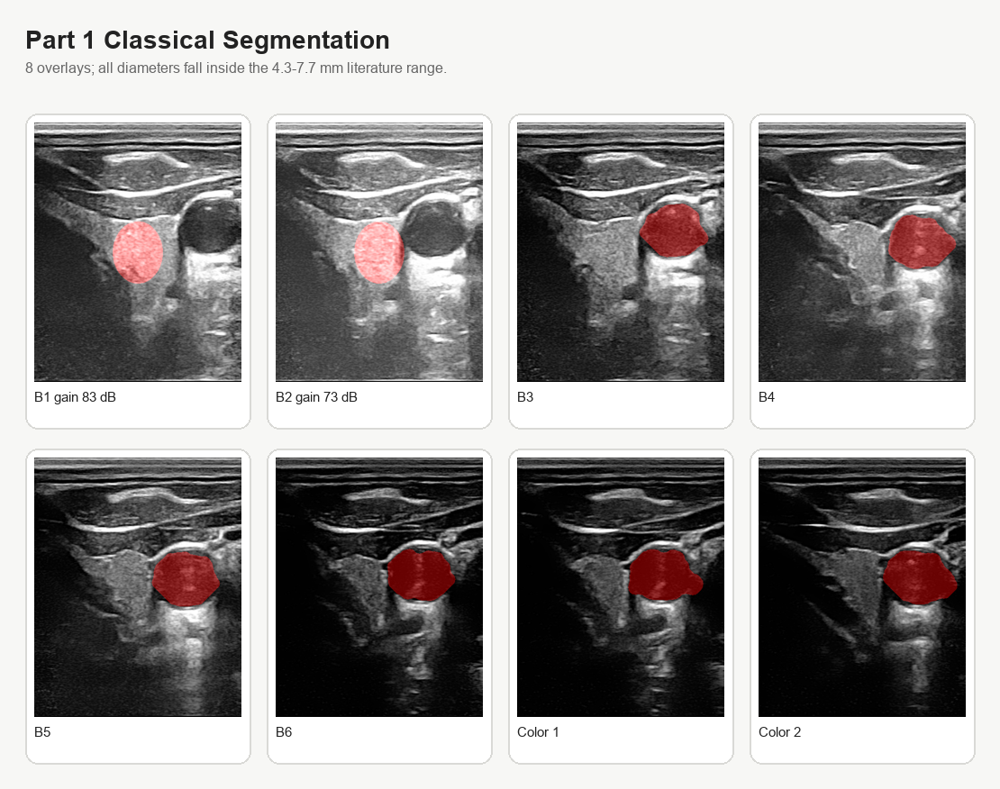
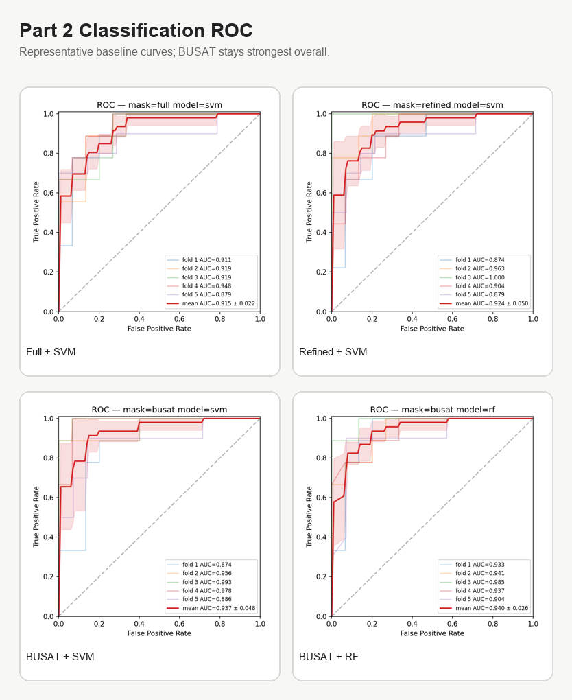
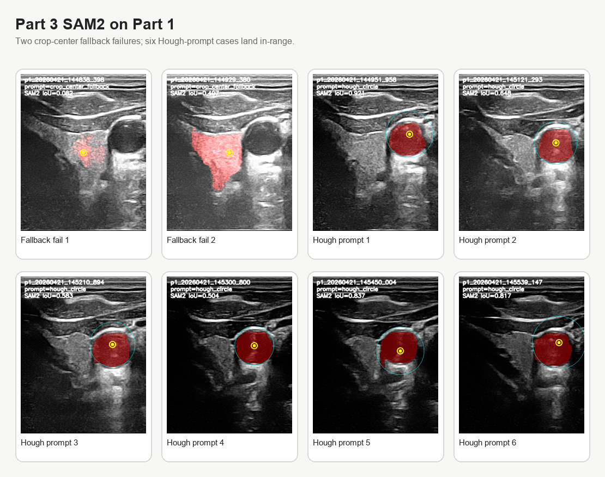
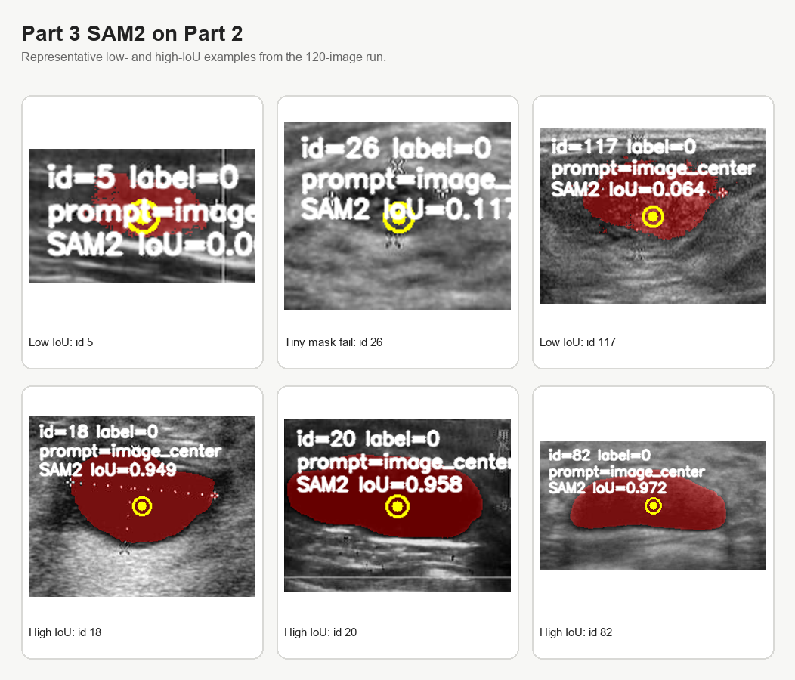
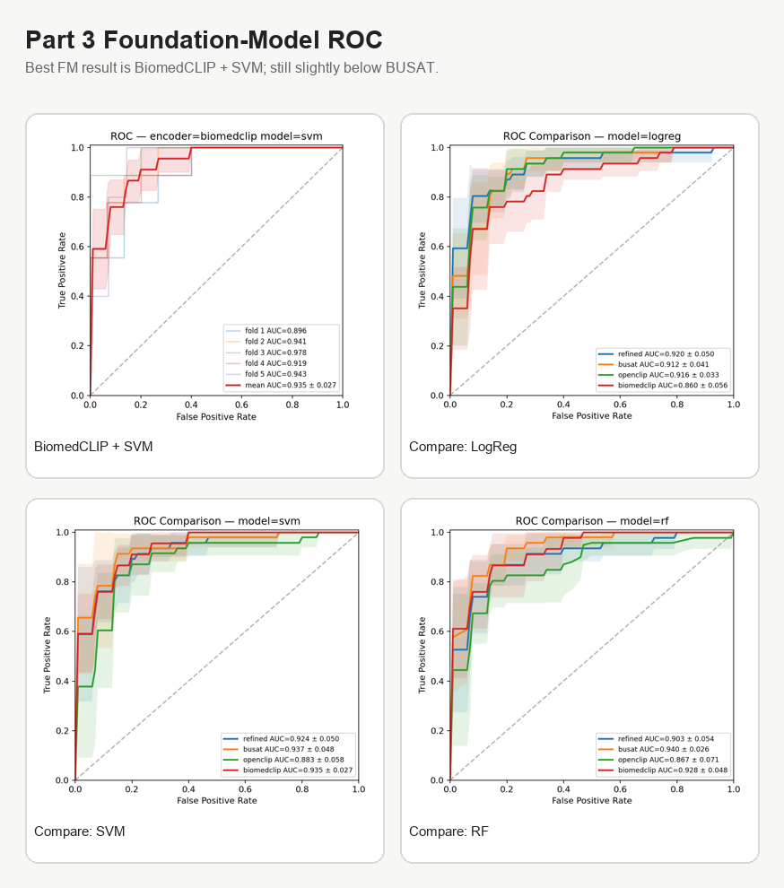

# 2026-04-24 — 成果图补充（排版优化）

> 这一版把原先的单图长列表压缩成 panel figures，更适合直接放进 Notion 和最终报告。
> 对应产物目录：`outputs/part1/`、`outputs/part2/`、`outputs/part3/`、`outputs/notion/`

---

## 0. Quick summary

| part | highlight | metric |
|---|---|---|
| Part 1 classical | 8 张颈动脉图全部落在文献直径范围内 | `8 / 8` in `4.3-7.7 mm` |
| Part 2 baseline | BUSAT 仍是当前最强 baseline | `BUSAT + RF AUC = 0.940`, `BUSAT + SVM ACC = 0.892` |
| Part 3 SAM2 on Part 1 | Hough prompt 明显优于 crop-center fallback | `6 / 8` in-range |
| Part 3 FM classification | foundation-model 里最优是 BiomedCLIP + SVM | `ACC = 0.858`, `AUC = 0.935` |

---

## 1. Part 1 classical segmentation

- 图里汇总了 6 张 B-mode 和 2 张 Color Doppler fallback overlay。
- 这一部分的 classical pipeline 在 8 张图上都给出了合理颈动脉候选。

---

## 2. Part 2 classification ROC

| setting | best accuracy | best AUC |
|---|---:|---:|
| full | 0.817 | 0.915 |
| refined | 0.875 | 0.924 |
| BUSAT | **0.892** | **0.940** |

- 这里只放最有代表性的四张 ROC：`full + svm`、`refined + svm`、`BUSAT + svm`、`BUSAT + rf`。
- 目的不是把 12 张 ROC 全堆进去，而是突出“refined 已接近 BUSAT，但 BUSAT 仍略强”。

---

## 3. Part 3 segmentation with SAM2

### 3.1 Part 1

- 前两张是 crop-center fallback 的失败案例。
- 后 6 张是 Hough point prompt，结果明显稳定得多。

### 3.2 Part 2

- 这里选了 3 张低 IoU / 失败案例和 3 张高 IoU 案例。
- 这样比把 120 张 overlay 全贴出来更能说明 zero-shot prompt segmentation 的波动性。

---

## 4. Part 3 foundation-model ROC

| encoder | model | accuracy | AUC |
|---|---|---:|---:|
| OpenCLIP | logreg | 0.833 | 0.916 |
| BiomedCLIP | svm | **0.858** | **0.935** |
| BUSAT baseline | svm | **0.892** | 0.937 |
| BUSAT baseline | rf | 0.883 | **0.940** |

- 这一页把 1 张 best FM ROC 和 3 张 comparison ROC 合在一起。
- 结论很直接：**BiomedCLIP + SVM 已经非常接近 BUSAT，但还没有超过。**

