# 2026-04-24 — 成果图补充

> 这份补充只放结果图，不重复正文分析。
> 对应仓库产物目录：`outputs/part1/`、`outputs/part2/`、`outputs/part3/`

---

## Part 1：颈动脉 classical segmentation overlays

---

## Part 2：classification ROC curves

---

## Part 3：SAM2 on Part 1

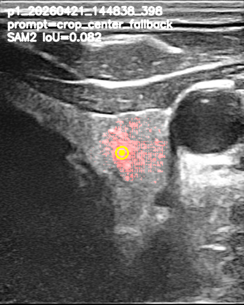

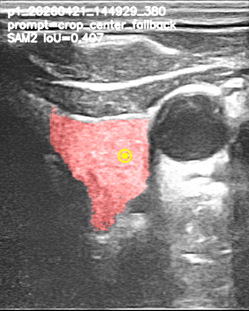

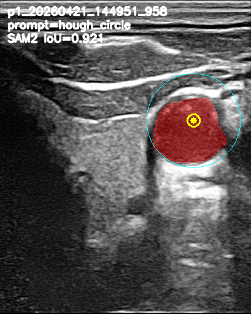

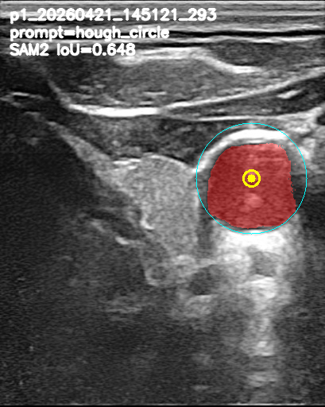

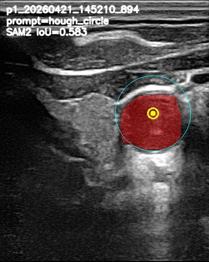

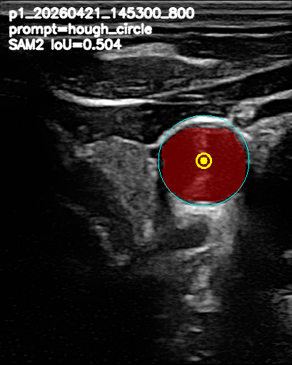

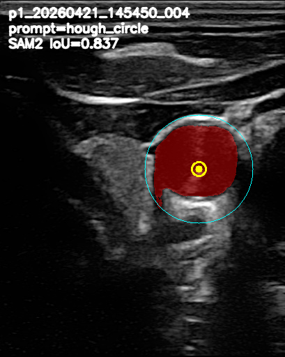

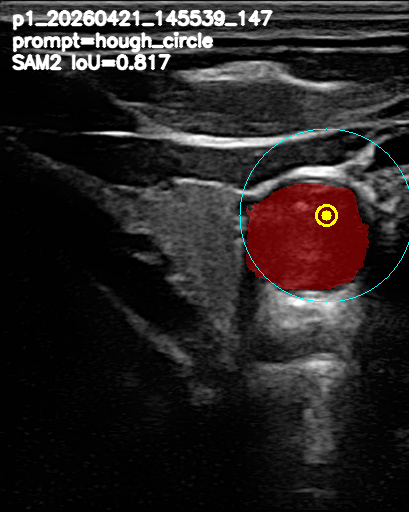

---

## Part 3：SAM2 on Part 2 representative overlays

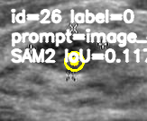

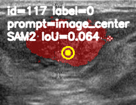

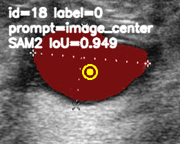

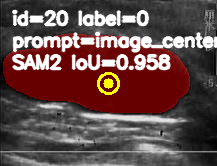

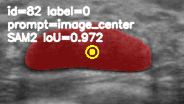

---

## Part 3：foundation-model ROC curves

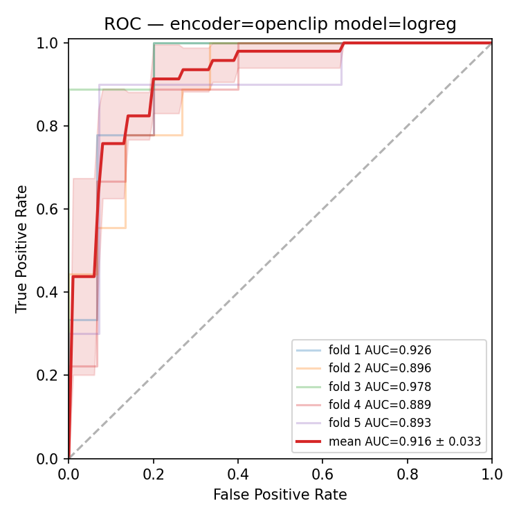

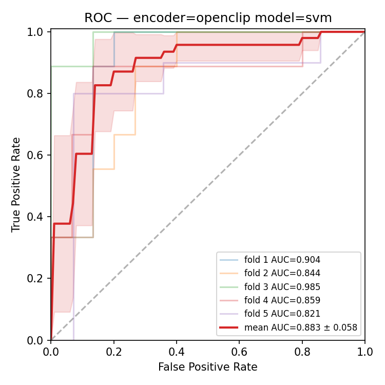

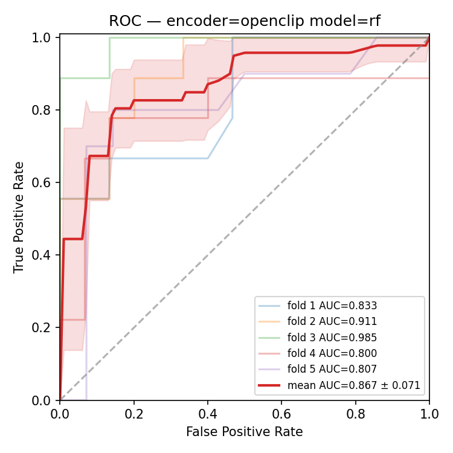

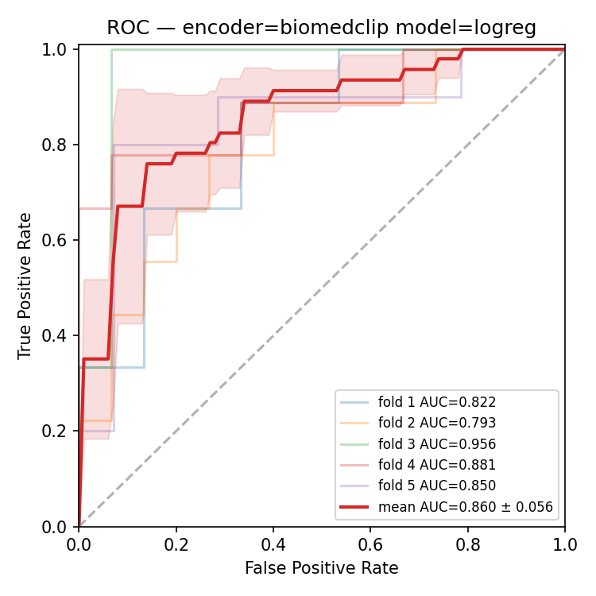

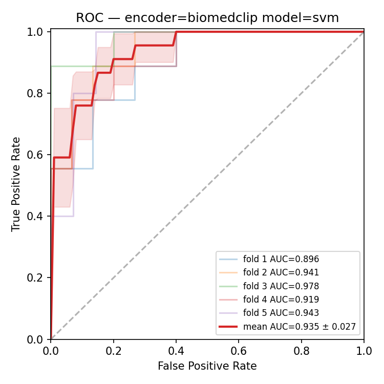

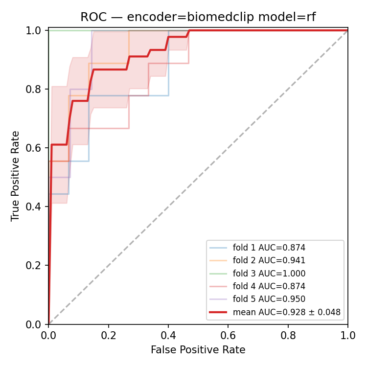

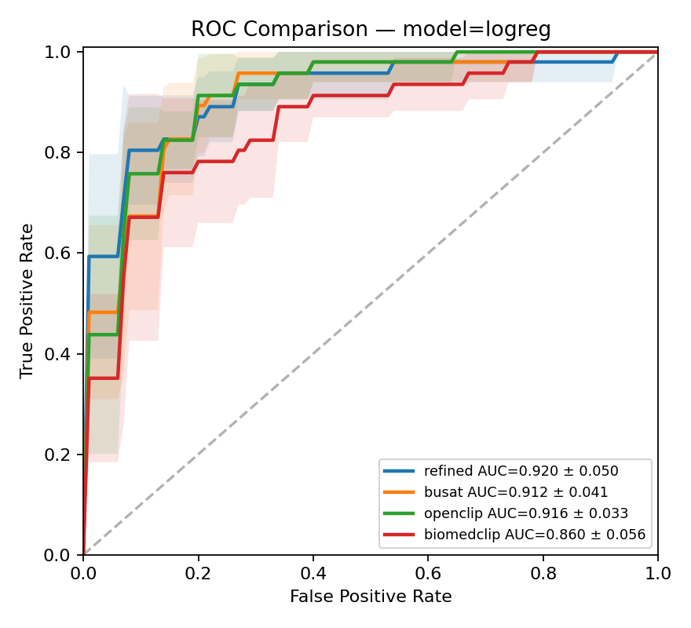

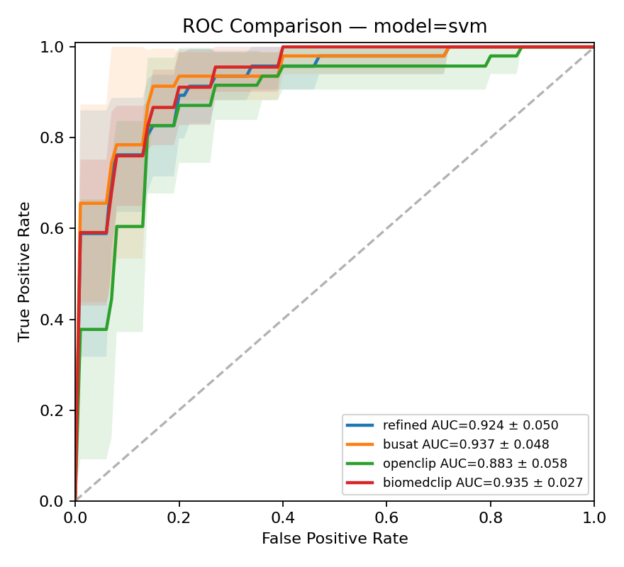

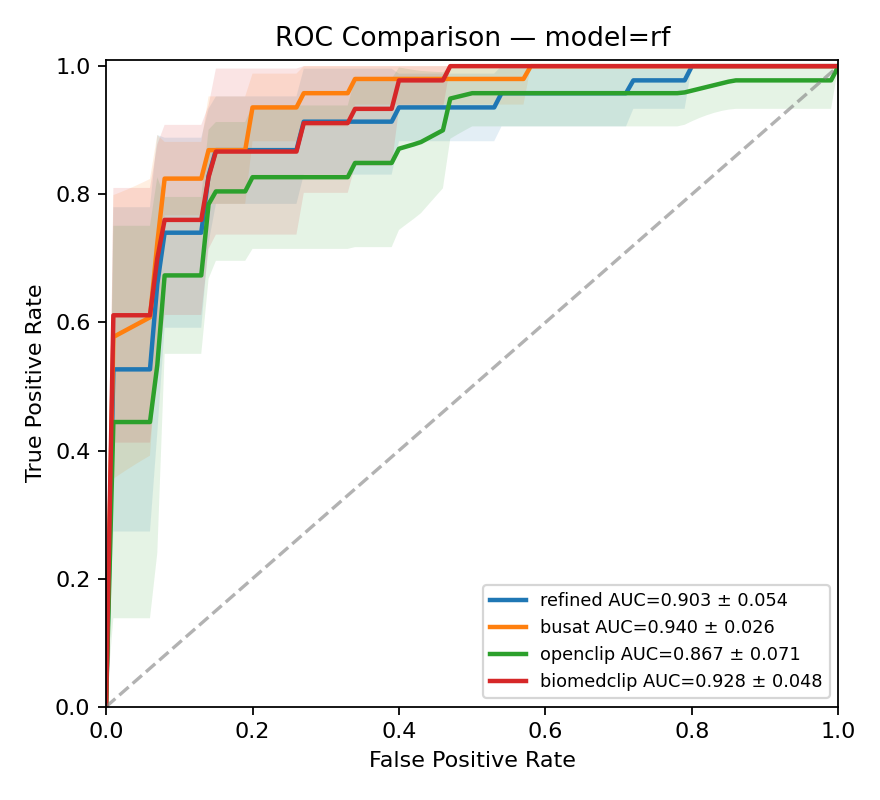
